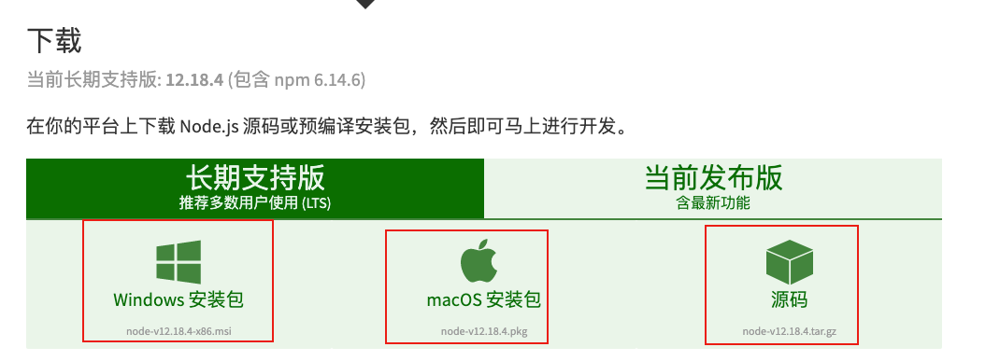

## 安装VsCode

VsCode下载地址:[https://code.visualstudio.com/download](https://code.visualstudio.com/download)


## 安装Node.js

Node.js下载地址:[https://nodejs.org/zh-cn/download/](https://nodejs.org/zh-cn/download/)





## 使用NPM安装第一个http服务器


```
npm install http-server -g
```


